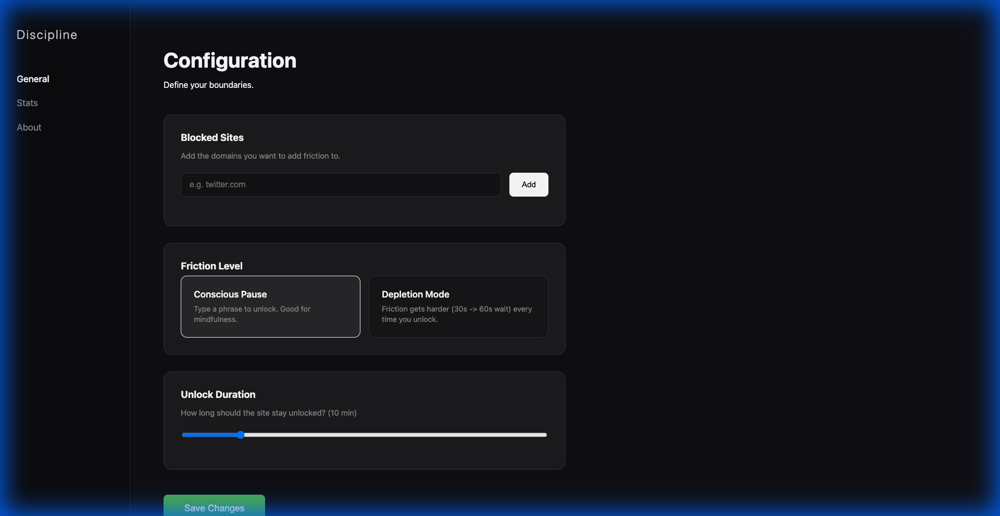

# Discipline (Chrome Extension)

**"You are in control. Not the algorithm."**

Discipline is a "Conscious Friction" extension designed to break the subconscious loop of opening distracting apps like Instagram, YouTube, and Twitter. Instead of blocking you completely (which leads to uninstallation), it forces you to pause, think, and type a conscious intention.

## Core Philosophy

Most site blockers fail because they treat you like a child. Discipline treats you like an adult who just needs a nudge. It doesn't say "NO," it asks "WHY?"

## Key Features

### 1. Conscious Intervention
When you open a blocked site, you aren't greeted with a "Blocked" page. You are greeted with **The Void**.
- **The Challenge**: To unlock the site, you must type the phrase: *"I am in control"* or *"Discipline equals freedom"*.
- **Conscious Confirmation**: After typing, a modal asks *"Are you sure?"* to prevent auto-pilot unlocking.
- **Neon Zoom Animation**: A dynamic background where motivational text zooms towards you from the darkness, reminding you of your goals.

### 2. Depletion Mode (Hardcore)
For those who need tougher love.
- **Escalating Friction**: Every time you unlock a site, the "waiting period" increases (30s -> 60s -> 90s).
- **The Boring Room**: You have to sit and stare at a timer before you can even type the unlock phrase. If you switch tabs, the timer resets.

### 3. Usage Tracking & Analytics
- **Visit Counter**: See exactly how many times you've relapsed and opened a blocked site today.
- **Visual Shame**: The count is displayed prominently on the intervention page.

### 4. Customizable Experience
- **Duration Slider**: Choose how long a site stays unlocked (1 - 60 minutes).
- **Block List**: Add or remove domains easily from the options page.

## Installation

1. Clone this repository.
2. Open Chrome and go to `chrome://extensions`.
3. Enable **Developer Mode** (top right).
4. Click **Load Unpacked**.
5. Select the `src` folder of this project.

## Tech Stack
- **Pure JavaScript, HTML, CSS**: No frameworks, lightweight and fast.
- **Chrome Storage API**: Persists your settings and stats securely.
- **CSS3 Animations**: High-performance "Neon Zoom" and "Breathing" effects.
